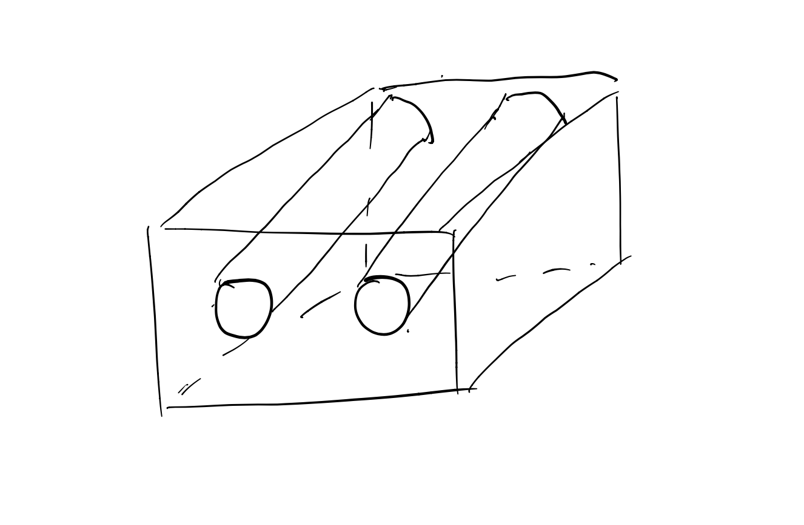
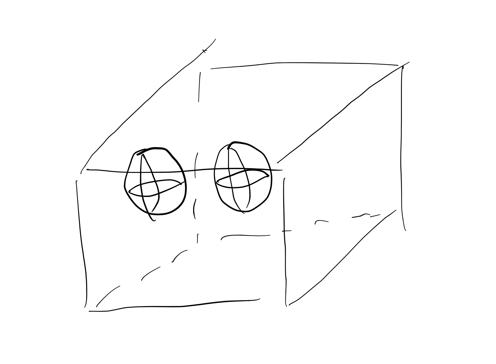
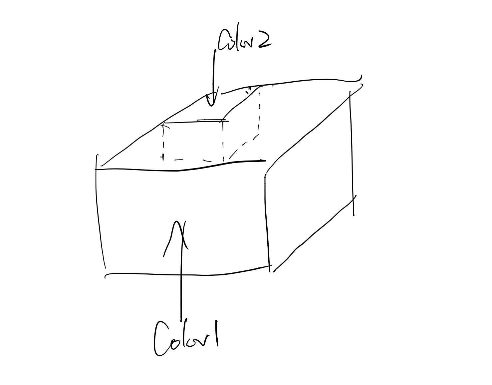

#
## Simple Voxel Carving
by Yuanbo Li

## Intro
This is a simple implementation of [voxel carving](http://www.cs.cmu.edu/~seitz/course/Sigg00/slides/seitz-voxel.pdf)
The UI is borrowed from homework code of [CSCI 1230, Brown University](https://csci1230.graphics/#local:2adf7699bbb83), with all original homework solutions deleted.

## Usage
The project will take three images as input, taken sequencily from the right, the front, and the left side of the object. And given any camera position, the App with show the view from the camera eyeing to the center of the orignal object. 

Example: 
We have rendered two spheres using ShaderToy, and took three photos. (1.png for right view, 2.png for front view, 3.png for left view).
<p>

<p\> 
      
Then open and read the input images using the UI (change the Image ID for different inputs, ids are 1,2,3). After finishing the three inputs, the App with generate a view from a camera located at position (0.8, 0.8, 2.5). We will discuss the design of coordinates later.

      
<p>

<p\> 


## Design

### Read Input
      
Three buffers will be created to store the inputs.
      
Three inputs can be any size. The size of the buffers would equal to size of the first input image. This means if the later inputs are larger than the first input, some of their data will automatically ignored.
      
### Process Input
      
We build a box with size: input width * input height * input width. And process all three inputs sequentially.
  
Step1: Process input2. The front view image. The spheres are presented as cylinders.
<p>

<p\> 
  
Step2: Process input1. The right view image.
<p>

<p\> 
  
Step3: Process input3. The left view image. Consider the object below: color2 will not be considered if we do not have input3. While adding more inputs from different perspective help to determine the shape of the object, yet "no finite set of input photographs can uniquely detemine their shape". [A Theory of Shape by Space Carving](https://www.cs.toronto.edu/~kyros/pubs/00.ijcv.carve.pdf)
<p>

<p\> 

Now we have a box reconstructed based on the three input images.
  
### Render

  Before start our rendering, we need to work on dealing with the different coordinates used in our project. 
  
  1)World coordination. We have the center of the front of our box placed at (0,0,0). To prevent changing the proportion of the objects, the box is resized to make width and height both 1.f, 1.f. This following graph shows how our box is located in the world position. The camera location ((0.8, 0.8, 2.5) in the example above), is also defined in world coordination.
<p>

<p\> 
How the box is placed in world coordination.
      
  2)Camera coordination. We multiply the camera matrix to make sure the camera is eyeing towards (0,0,0) in the wold coordination.
  
  3)Corrdination in the box. Given a position in the world coordination, we want to know which what is the depth, row number, and column number of the position inside the box. Here is my calculation:
  
  ```
x = (u+inputWidth) * inputWidth
y = (0.5-v) * inputHeight
z = z'*inputWidth
  ```

  
  4)Index number in the box. Remember the box is a vector(a pointer, actually) of RGBA*, we don't have real xyz coordinates inside the box. Here is how I translated 
  ```
  i = x + y*inputWidth + z*inputWidth*inputHeight
  //this voxel is dataBox[i]
  ```

  Now we can do a Raymarch.
  
  I choose raymarch because it is easy to start from the camera position, going step by step for each pixel on the screen. If we encounter a pixel with color in the box, return the color. Raytrace is not chosen since we have no idea the shape of the object in the box, and thus very hard to do intersections.
  
  ## Some Results
 
      ro = (0.,0.,3.5)
<p>

<p\> 
      ro = (-1.,-1.,-1.5)
<p>

<p\> 
      
      ro = (.5, .5, -1.5)
<p>

<p\> 

  ## Next Steps
