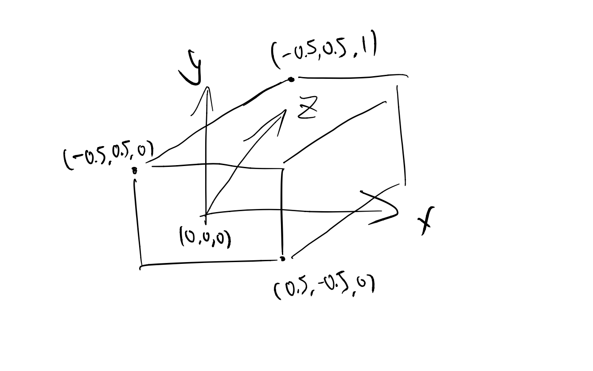
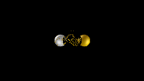
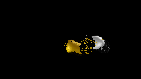
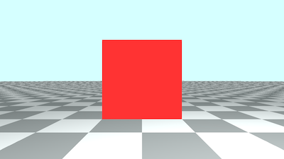
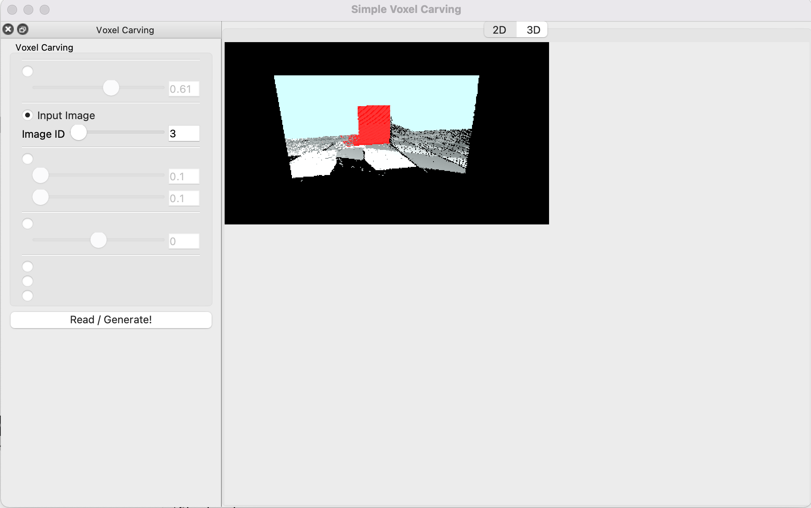
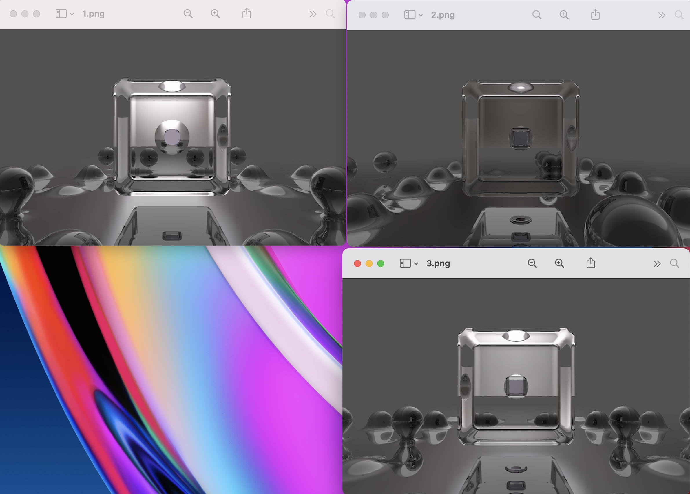
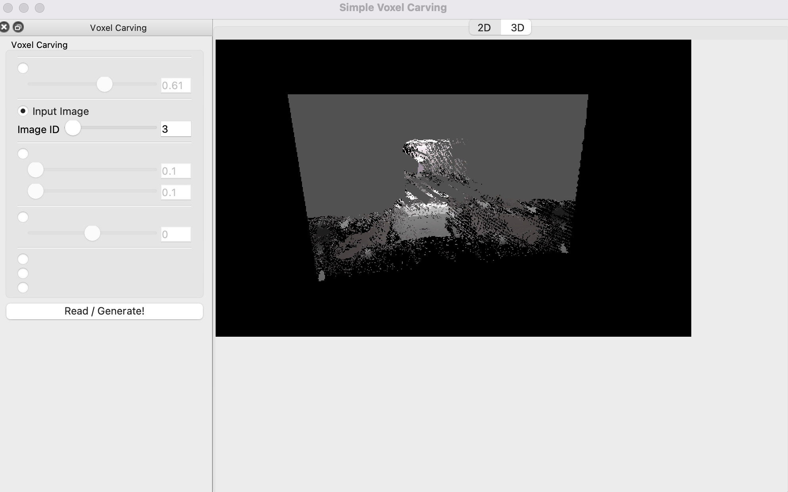

#
## Simple Voxel Carving
 Yuanbo Li

## Intro
This is a simple implementation of [voxel carving](http://www.cs.cmu.edu/~seitz/course/Sigg00/slides/seitz-voxel.pdf).
The UI is borrowed from homework code of [CSCI 1230, Brown University](https://csci1230.graphics/#local:2adf7699bbb83), with all original homework solutions deleted.

## Usage
The project will take three images as input, taken sequentially from the right, the front, and the left side of the object. Given any camera position, the App with reconstruct a 3D of the camera eyeing towards the center of the object. 

Example: 
We have rendered two spheres using ShaderToy, and took three photos. (1.png for the right view, 2.png for the front view, 3.png for the left view).
<p>

<p\> 
      
Open and read the input images using the UI (change the Image ID for different inputs, ids are 1,2,3). The App with generate a view from a camera located at position (0.8, 0.8, 2.5). The design of coordinates later will be discussed in the following section.

      
<p>

<p\> 


## Design

### Read Input
      
Three buffers will be created to store the inputs.
      
Three inputs can be any size. The size of the buffers would equal to size of the first input image. This means if the later inputs are larger than the first input, some of their data will be automatically ignored.
      
### Process Input
      
We build a box with size: input width * input height * input width. We go through each pixel in the box, and convert them into coordinate of the inputs.

Determine which color to apply when some inputs consists and some doesn't is complicated. But in our method, we simply choose to apply the color if >= 2 inputs consists.

Now we have a box reconstructed based on the three input images.
  
### Render

  Before start our rendering, we need to work on dealing with the different coordinates used in our project. 
  
  1)World coordination. We have the center of the front of our box placed at (0,0,0). To prevent changing the proportion of the objects, the box is resized to make width and height both 1.f, 1.f. This following graph shows how our box is located in the world position. The camera location ((0.8, 0.8, 2.5) in the example above), is defined in world coordination.
<p>

<p\> 
 
How the box is placed in world coordination.
      
  2)Camera coordination. We multiply the camera matrix to make sure the camera is eyeing towards (0,0,0) in the wold coordination, and we have the canonical view.
  
  3)Corrdination in the box. Given a position in the world coordination, we want to know what is the depth, row number, and column number of the position inside the box. Here is the calculation:
  
  ```
x = (u+inputWidth) * inputWidth
y = (0.5-v) * inputHeight
z = z'*inputWidth
  ```

  
  4)Index number in the box. Remember the box is a vector(a pointer, actually) of RGBA*, we don't have real xyz coordinates inside the box. Here is the calculation:
  ```
  i = x + y*inputWidth + z*inputWidth*inputHeight
  //this voxel is dataBox[i]
  ```

  Now we can do a Raymarch.
  
  I choose raymarch because it is easy to start from the camera position, going step by step for each pixel on the screen. If we encounter a pixel with color in the box, return the color. Raytrace is not chosen since we have no idea the shape of the object in the box, and thus very hard to do intersections.
  
  ## Some Results
  
  ### Change Ray Origin (good)

 
      ro = (0.,0.,3.5)
<p>

<p\> 
      
      ro = (-1.,-1.,-1.5)
<p>

<p\> 
      
      ro = (.5, .5, -1.5)
<p>

<p\> 

  ### Change Object + Add floor (good)
  
  Original inputs vs Reconstructed 
  
<p>

<p\> 

<p>

<p\> 

  ### Work on a Transparent Object (failed)
  
  Original inputs vs Reconstructed 
 

  Our algorithm would attempt to project each pixel in the box and find if the same color appear in the inputs. Yet the transparent nature of the inputs made it hard to find consistent colors.  
  
<p>

<p\> 

<p>

<p\> 

  ## Next Steps
1.Allowing more inputs. Adding more inputs from different perspectives would help distinguish more complicated shapes. Yet I haven't figured out how to adapt input images with angles into the data box.

2.There are some color fragments floating on the air. I guess these fragments are a result of casting when doing the coordinator conversion, but I haven't find out a way to clear them
 
